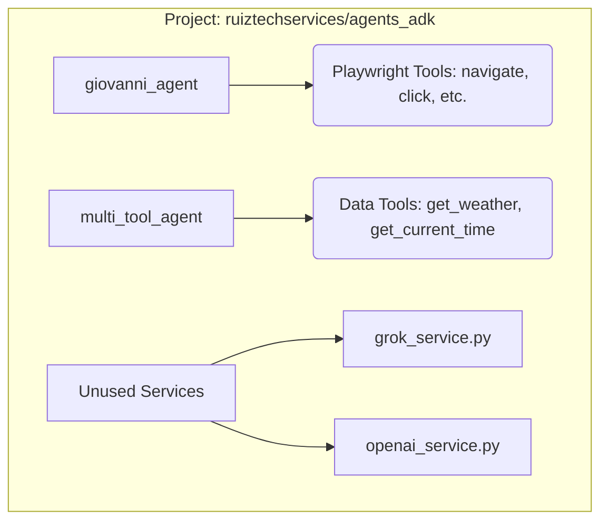

# agents_adk

This is a collection of agents that can be used to interact with the web.

## Agents

### giovanni_agent

This agent is a web browser agent that can navigate to a URL and click on elements specified by a CSS selector.

### multi_tool_agent

This agent is a multi-tool agent that can perform various tasks such as getting the current time, getting the weather, etc.

### Unused Services

- grok_service.py
- openai_service.py

    [ ]These services are not used in the agents but will be included in the future[TODO].


## Diagrams

### Agent Diagram


    [ ]This diagram is not complete[TODO].


## Installation

```bash
pip install -r requirements.txt
```

## Usage

```python
from giovanni_agent import giovanni_agent

agent = giovanni_agent()
agent.run()
```

## License

MIT

## Author

Giovanni Ruiz

## Contact

Giovanni Ruiz - luisruiz@ruiztechservices.com

## Version

1.0.0

## Date

2025-07-10

