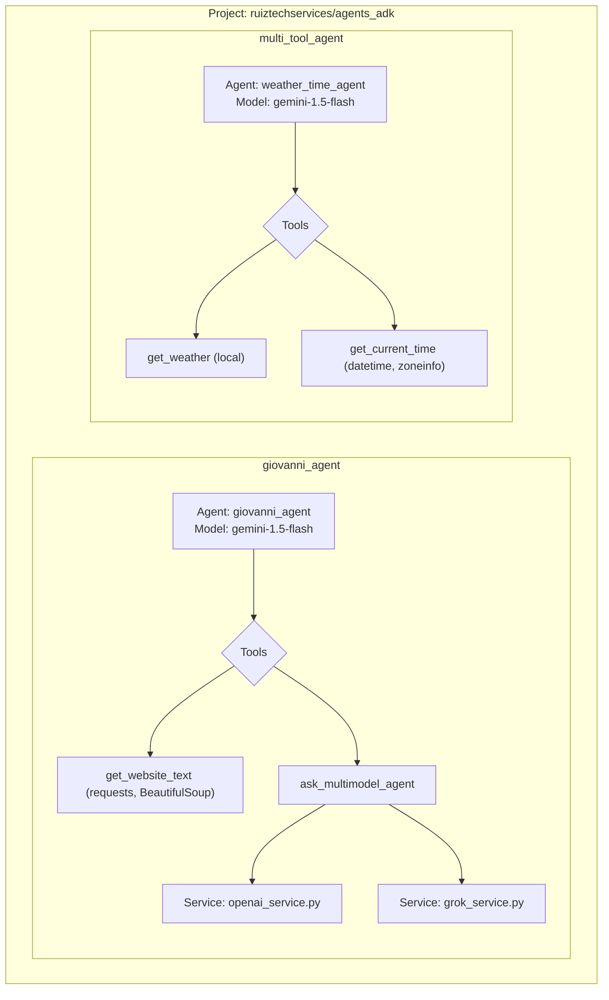

# Agent Development Kit (ADK) - A Collection of Web-Interacting Agents

This project provides a collection of autonomous agents built with the Google Agent Development Kit (ADK). These agents are designed to perform various tasks, from browsing the web to providing real-time information.

## Agents

### Giovanni Agent

The `giovanni_agent` is a powerful web browsing agent that can navigate to a URL, extract its text content, and leverage other AI models (OpenAI and Grok) for further analysis.

- **Model:** `gemini-2.0-flash`
- **Tools:**
    - `get_website_text`: Fetches and parses the visible text from a given URL.
    - `ask_multimodel_agent`: Routes prompts to either OpenAI or Grok.

### Weather and Time Agent

The `weather_time_agent` is a specialized agent that provides the current weather and time for a specified city (currently limited to New York).

- **Model:** `gemini-1.5-flash`
- **Tools:**
    - `get_weather`: Retrieves the current weather report.
    - `get_current_time`: Returns the current time in a specified time zone.

## System Architecture



## Getting Started

Follow these steps to set up your environment and run the agents.

### 1. Create and Activate a Virtual Environment

It's recommended to use a virtual environment to manage project dependencies.

**On Windows:**
```bash
python -m venv .venv
.venv\Scripts\activate
```

**On macOS/Linux:**
```bash
python3 -m venv .venv
source .venv/bin/activate
```

### 2. Install Dependencies

Once your virtual environment is activated, install the required packages:

```bash
pip install -r requirements.txt
```

## Usage

You can interact with the agents using the ADK web interface or by running them directly.

### Using the ADK Web Interface (Recommended)

This method provides a user-friendly interface for interacting with your agents.

```bash
adk web
```

This will start a local web server. Open the provided URL in your browser to access the agent interface.

### Running Agents Directly

#### Giovanni Agent

To run the `giovanni_agent` directly in your terminal:

```bash
python -m giovanni_agent.agent
```

#### Weather and Time Agent

To run the `weather_time_agent` and see example outputs:

```python
from multi_tool_agent.agent import root_agent

# Example: Get the weather in New York
response = root_agent.run('What is the weather in New York?')
print(response)

# Example: Get the current time in New York
response = root_agent.run('What time is it in New York?')
print(response)
```

## License

This project is licensed under the MIT License.

## Author

- **Giovanni Ruiz** - [luisruiz@ruiztechservices.com](mailto:luisruiz@ruiztechservices.com)

## Version

1.0.0

## Date

2025-07-11
